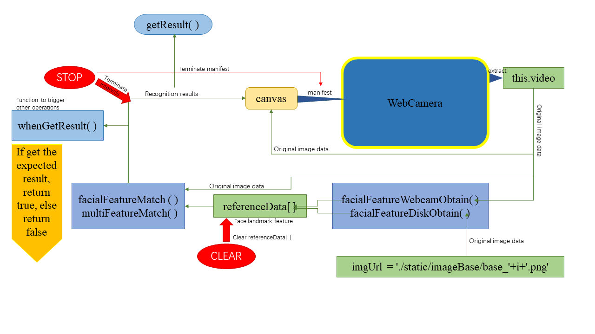
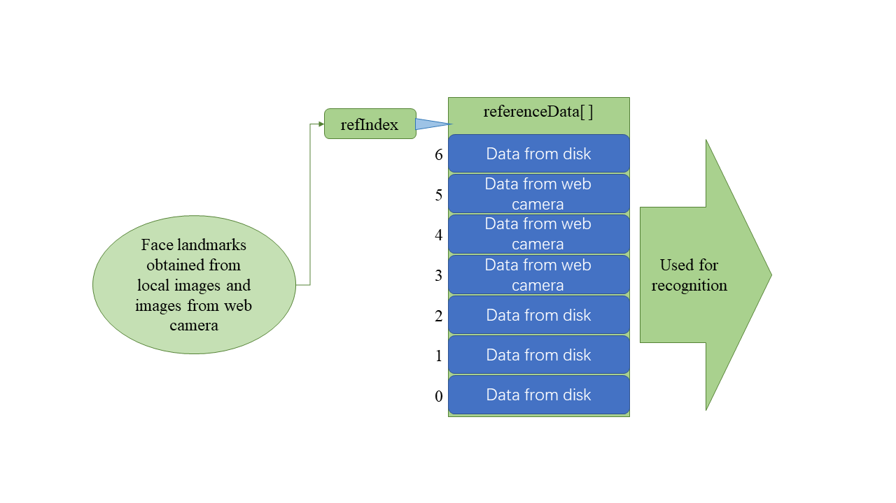

在Scratch3中加入人脸识别功能
=================================

README.md中涉及了fece-api.js在Scratch3中基本的安装过程，基本实现了实时人脸检测的功能。
此.md文件的主要内容为如何进一步地使用face-api.js所提供的API在Scratch3的index.js中进行修改，使其实现人脸识别的功能。
如果对face-api.js的API有进一步的兴趣，或者希望利用它自主开发更多有趣的功能，建议查看[face-api.js](https://github.com/justadudewhohacks/face-api.js#high-level-api)。

### 基本结构

&emsp;<br>

### 好的，我们进入代码

如果只是希望实现人脸识别功能，可以跳过以下段落，直接进入“操作方法”部分。

首先我们从本地读取图片用于人脸识别：
``` javascript
facialFeatureDiskObtain(args)
        {
            var num = args.IMAGENUM //the number of base images that you want to load
            var faceRef = []
            

            this.timer = setTimeout(async () => {
                
                const labels = ['penny','raj', 'sheldon', 'howard','bernadette']
                for(var i = 0; i< num ; i++){
                        // fetch image data from urls and convert blob to HTMLImage element
                    imgUrl = './static/imageBase/base_'+i+'.png'
                    const img = await faceapi.fetchImage(imgUrl)
                    if(img) {
                        // detect the face with the highest score in the image and compute it's landmarks and face descriptor
                        faceRef = await faceapi
                        .detectSingleFace(img)
                        .withFaceLandmarks()
                        .withFaceDescriptor()
    
                        const faceDescriptor = [faceRef.descriptor]
                        referenceData[refIndex] = new faceapi.LabeledFaceDescriptors(labels[i], faceDescriptor)
                        console.log(referenceData[refIndex])
                        if (!referenceData[refIndex]) {
                            
                            return
                        }
                        refIndex += 1 // length of array plus one
                    }
                }
             },1000)   
        }      
```
首先，我们读取输入的形参args.IMAGENUM，这一参数由用户设置，用于指出读取几张图片。faceRef作为数组，存放人脸检测得到的人脸数据。referenceData[]为全局变量，用于存放读取得到的人脸特征数据，设置为全局变量的原因是考虑到之后通过摄像头(webcam)读取的人脸特征数据也可以存储到同一数组下，便于人脸识别和统一管理（此处指统一清空）,refIndex 为服务于此过程的一个变量，在获得人脸特征后加1（refIndex += 1），在STOP选项中被清0。<br><br>

值得注意的是，上述程序中 imgUrl = './static/imageBase/base_'+i+'.png' 语句限定了存放在./static/imageBase/ 路径下的图像文件必须以“base_<编号>” 的方式命名，并以.png的方式存储才能被正确读取。这是目前此 index.js 的一个缺点，虽然作为开源程序可以通过直接修改imgUrl 的架构方式做出一定限度上的修改，但理想的处理方式应该是能够以某种方式通过Scratch3 的GUI界面选项更加灵活地修改。<br><br>

除此之外，我们也可以从Scratch3自带的摄像头读取数据：
```javascript
 facialFeatureWebcamObtain(args){
            var num = args.IMAGENUM //the number of base images that you want to load
            var faceRef = [] //a cache space for raw data obtained from webcam
            
            this.timer = setTimeout(async () => {
                //const labels = ['sheldon','raj', 'leonard', 'howard']
                for(var i = 0; i< num ; i++){
                        
                    // detect the face with the highest score in the image and compute it's landmarks and face descriptor
                    faceRef[i] = await faceapi
                    .detectSingleFace(this.video, new faceapi.TinyFaceDetectorOptions({ inputSize: 224, scoreThreshold: 0.5 }))
                    .withFaceLandmarks()
                    .withFaceDescriptor()

                    //console.log(faceRef[i])
                    if(faceRef[i] == undefined) { 
                        i-- 
                        alert("Please stay within the boundary of webcam, thanks!")
                        continue
                    }
                    else{

                        const faceDescriptor = [faceRef[i].descriptor]
                        referenceData[refIndex] = new faceapi.LabeledFaceDescriptors(args.NAME,faceDescriptor)
                        console.log(referenceData[refIndex])
                        refIndex += 1 // length of array plus one
                    }
                }
            },1000)   
        }
```
同样的，args.IMAGENUM 传入读取的图片张数，更准确来说是对于同一标签的图像的读取次数。正如基本结构中所示，无论是从本地读取图片还是从Scratch3自带摄像头读取图片，最终都转换为人脸特征（faceRef.descriptor）的形式存储到 referenceData[]中，以供之后的识别部分使用。<br><br>

referenceData[ ] 的数据输入和输出如下图所示：<br><br>

&emsp;<br><br>

此时，我们可以使用facialFeatureMatch() 和multiFeatureMatch() 来比对从摄像头输入的人脸特征和referenceData[ ]中的人脸特征从而得到识别结果。<br><br>

<此处添加gif>

facialFeatureMatch() 代码段如下：
```javascript
facialFeatureMatch(){

            const originCanvas = this.originCanvas  // 右上侧canvas
            const canvas = this.canvas  // 创建用于绘制canvas


            canvas.width = 480
            canvas.height = 360

            // 将绘制的canvas覆盖于原canvas之上
            originCanvas.parentElement.style.position = 'relative'
            canvas.style.position = 'absolute'
            canvas.style.top = '0'
            canvas.style.left = '0'
            originCanvas.parentElement.append(canvas)


            this.timer = setInterval(async () => {
                // create FaceMatcher with automatically assigned labels
                // from the detection results for the reference image
                const faceMatcher = new faceapi.FaceMatcher(referenceData)
                const queryImage =  await faceapi
                    .detectSingleFace(this.video, new faceapi.TinyFaceDetectorOptions({ inputSize: 224, scoreThreshold: 0.5 })).withFaceLandmarks().withFaceDescriptor()
                if (queryImage) {
                    const displaySize = {width: 400 , height: 300}
                    const resizedDetections = faceapi.resizeResults(queryImage, displaySize)
                    const bestMatch = faceMatcher.findBestMatch(queryImage.descriptor)
                    recognition = bestMatch.label
                    var box = { x: 50, y: 50, width: 100, height: 100 }
                    box.x = resizedDetections.detection.box.x 
                    box.y = resizedDetections.detection.box.y 
                    box.width = resizedDetections.detection.box.width 
                    box.height = resizedDetections.detection.box.height 
                    canvas.getContext('2d').clearRect(0, 0, canvas.width, canvas.height)
                    const drawBox = new faceapi.draw.DrawBox(box, { label: recognition })
                    drawBox.draw(canvas)
                    //recognition = recognition.substring(recognition.length-5)
                    console.log(recognition)
                    //return text
                }
            },500);
        }   
```


