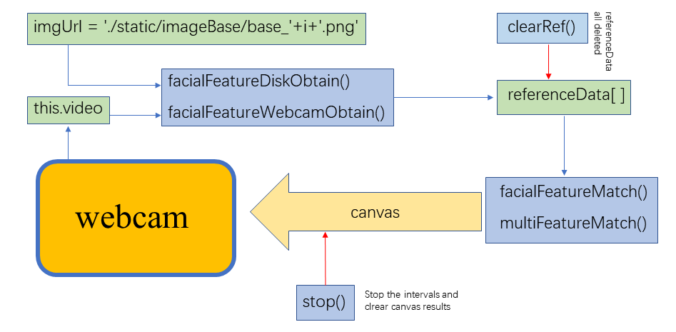

在Scratch3中加入人脸识别功能
=================================

README.md中涉及了fece-api.js在Scratch3中基本的安装过程，基本实现了实时人脸检测的功能。
此.md文件的主要内容为如何进一步地使用face-api.js所提供的API在Scratch3的index.js中进行修改，使其实现人脸识别的功能。
如果对face-api.js的API有进一步的兴趣，或者希望利用它自主开发更多有趣的功能，建议查看[face-api.js](https://github.com/justadudewhohacks/face-api.js#high-level-api)。

### 基本结构

&emsp;<br>

### 好的，我们进入代码

如果只是希望实现人脸识别功能，可以跳过以下段落，直接进入“操作方法”部分。

首先我们从本地读取图片用于人脸识别：
``` javascript
facialFeatureDiskObtain(args)
        {
            var num = args.IMAGENUM //the number of base images that you want to load
            var faceRef = []
            

            this.timer = setTimeout(async () => {
                
                const labels = ['penny','raj', 'sheldon', 'howard','bernadette']
                for(var i = 0; i< num ; i++){
                        // fetch image data from urls and convert blob to HTMLImage element
                    imgUrl = './static/imageBase/base_'+i+'.png'
                    const img = await faceapi.fetchImage(imgUrl)
                    if(img) {
                        // detect the face with the highest score in the image and compute it's landmarks and face descriptor
                        faceRef = await faceapi
                        .detectSingleFace(img)
                        .withFaceLandmarks()
                        .withFaceDescriptor()
    
                        const faceDescriptor = [faceRef.descriptor]
                        referenceData[refIndex] = new faceapi.LabeledFaceDescriptors(labels[i], faceDescriptor)
                        console.log(referenceData[refIndex])
                        if (!referenceData[refIndex]) {
                            
                            return
                        }
                        refIndex += 1 // length of array plus one
                    }
                }
             },1000)   
        }      
```
首先，我们读取输入的形参args.IMAGENUM，这一参数由用户设置，用于指出读取几张图片。faceRef作为数组，存放人脸检测得到的人脸数据。referenceData[]为全局变量，用于存放读取得到的人脸特征数据，设置为全局变量的原因是考虑到之后通过摄像头(webcam)读取的人脸特征数据也可以存储到同一数组下，便于人脸识别和统一管理（此处指统一清空）,refIndex 为服务于此过程的一个变量，在获得人脸特征后加1（refIndex += 1），在STOP选项中被清0。<br><br>

faceRef.descriptor 的具体内容如下图所示。

值得注意的是，上述程序中 imgUrl = './static/imageBase/base_'+i+'.png' 语句限定了存放在./static/imageBase/ 路径下的图像文件必须以“base_<编号>” 的方式命名，并以.png的方式存储才能被正确读取。这是目前此 index.js 的一个缺点，虽然作为开源程序可以通过直接修改imgUrl 的架构方式做出一定限度上的修改，但理想的处理方式应该是能够以某种方式通过Scratch3 的GUI界面选项更加灵活地修改。<br><br>


